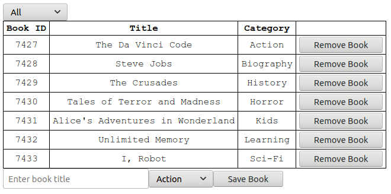

# Magic-Books Inc

This project is about creating a very simple React and Redux application. Working on a real world project for a fictitious company that requires help. They have requested help to build the front-end of an application that will help them organize and manage their bookstore. They want it to be fast, dynamic, and responsive to their actions. The project has been split into several milestones, and each milestone has functional and technical requirements that were implemented.



## :package: Built With

- HTML and JSX
- CSS
- Javascript (ES6)
- React
- Redux
- npm

## :mag: Live Demo

[Live Demo Link](https://magic-books-app-project.herokuapp.com/)

## :computer: Getting Started

To get a local copy up and running follow these simple steps.


### Download

1) Clone the repository to your local machine

```sh
  $ git clone https://github.com/mcervantes71/Magic-Books_Inc.git
```

2) cd into the directory

```sh
  $ cd Magic-Books_Inc
```

### Requirements

[Node.js](https://nodejs.org) is required to install dependencies and run scripts via `npm`.

### Usage

```sh
  $ npm install
```

Build project and open web server running project

```sh
  $ npm start
```

Runs the app in the development mode. Open [http://localhost:3000](http://localhost:3000) to view it in the browser.

The page will reload if you make edits.You will also see any lint errors in the console.

```sh
  $ npm run build
```

Builds the app for production to the `build` folder. It correctly bundles React in production mode and optimizes the build for the best performance.

The build is minified and the filenames include the hashes. Your app is ready to be deployed!

```sh
  $ npm test
```

Launches the test runner in the interactive watch mode.


## :busts_in_silhouette: Authors

👤 **Martin Cervantes**

- Linkedin: [Martin Cervantes](https://www.linkedin.com/in/cervantesmartin/)
- Twitter: [@M4rt1nC3rv4nt3s](https://twitter.com/M4rt1nC3rv4nt3s)
- Github: [@mcervantes71](https://github.com/mcervantes71)
- Gmail: [cervantes.martine](mailto:cervantes.martine@gmail.com)

## 🤝 Contributing

    Contributions, issues and feature requests are welcome!

Feel free to check the [issues page](../../issues).

## :star2: Show your support

    Give a ⭐️ if you like this project!

## 📝 License

This project is [MIT](lic.url) licensed.
